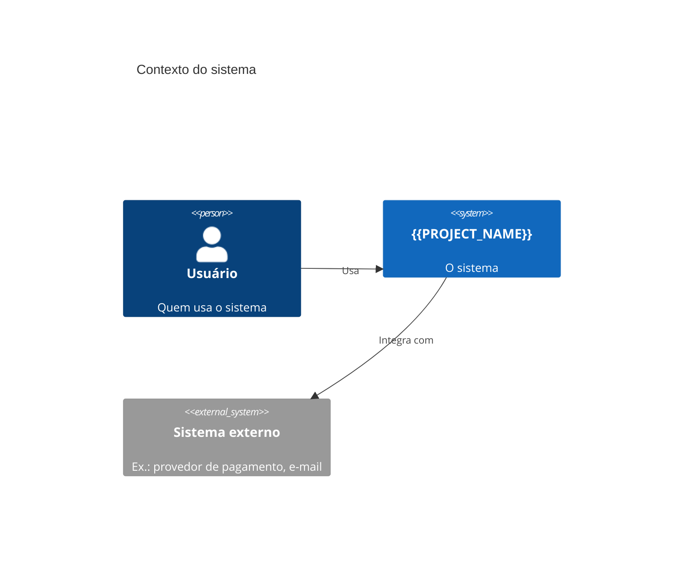
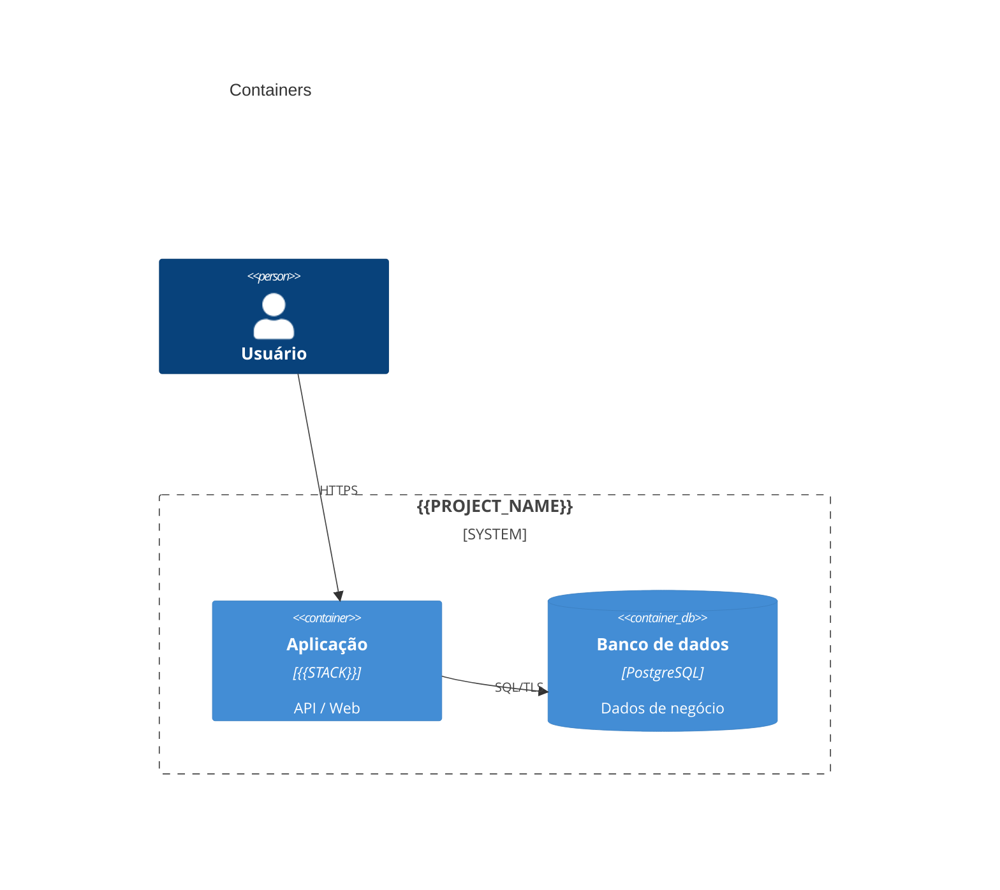

# Visão geral da arquitetura

> Documento vivo. Atualize quando o sistema mudar de forma relevante.
> Estrutura inspirada no [arc42](https://arc42.org) (enxuto) + [C4 Model](https://c4model.com).

## 1. Contexto e objetivo

<!-- Que problema o sistema resolve? Para quem? Por que agora? -->

- **Problema:**
- **Usuários / atores:**
- **Fora de escopo:**

## 2. Escopo do MVP

| # | Capacidade | Prioridade (MoSCoW) |
| - | ---------- | ------------------- |
| 1 |            | Must                |

## 3. Requisitos não funcionais (mensuráveis)

| Atributo        | Meta                                    | Como medir             |
| --------------- | --------------------------------------- | ---------------------- |
| Performance     | ex.: p95 < 300 ms @ 100 req/s           | teste de carga (k6)    |
| Disponibilidade | ex.: 99,5% mensal                       | uptime / SLO           |
| Segurança       | ex.: OWASP ASVS nível 2                 | checklist + scanners   |
| Escalabilidade  | ex.: 10k usuários ativos                | teste de carga         |
| Custo           | ex.: < US$ 50/mês em produção           | billing                |
| Manutenibilidade| ex.: cobertura ≥ 80% no domínio         | CI                     |
| Privacidade     | ex.: conformidade LGPD                  | revisão de dados       |

## 4. Restrições

<!-- Técnicas, legais, orçamento, prazos, tecnologias obrigatórias -->

## 5. C4 — Nível 1: Contexto

## 6. C4 — Nível 2: Containers

## 7. Módulos (bounded contexts)

| Módulo | Responsabilidade | Depende de |
| ------ | ---------------- | ---------- |
|        |                  |            |

## 8. Decisões

Ver [ADRs](adr/). Liste aqui as mais importantes:

- [ADR 0001](adr/0001-registrar-decisoes-com-adr.md) — Registrar decisões com ADR
- [ADR 0002](adr/0002-monolito-modular-hexagonal.md) — Monólito modular + hexagonal

## 9. Riscos e débitos técnicos

| Risco / débito | Impacto | Mitigação | Issue |
| -------------- | ------- | --------- | ----- |
|                |         |           |       |
