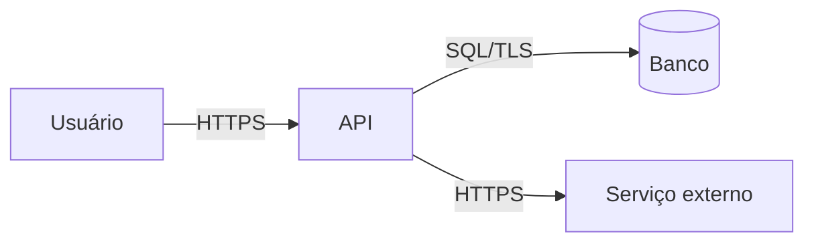

# Modelagem de ameaças (STRIDE leve)

Faça no **design** de cada feature que toca dados sensíveis, autenticação, pagamentos,
integrações externas ou entrada de usuário (o `/spec` pede isso na fase de design).
Leva de 15 a 30 minutos e evita descobrir o problema em produção.

## 1. O que estamos construindo?

Desenhe o fluxo de dados (pode ser Mermaid): atores, componentes, armazenamentos e
**fronteiras de confiança** (onde o dado passa de "não confiável" para "confiável").

## 2. O que pode dar errado? (STRIDE)

| Ameaça | Pergunta-chave | Exemplo | Mitigação típica |
| ------ | -------------- | ------- | ---------------- |
| **S**poofing (falsificação de identidade) | Alguém pode se passar por outro usuário/serviço? | Token roubado, webhook sem assinatura | Autenticação forte, MFA, validação de assinatura |
| **T**ampering (adulteração) | Dados podem ser alterados em trânsito ou em repouso? | Alterar preço no payload | Validação no servidor, TLS, integridade (HMAC) |
| **R**epudiation (repúdio) | Alguém pode negar que fez uma ação? | "Não fui eu que aprovei" | Log de auditoria imutável (quem, o quê, quando) |
| **I**nformation disclosure (vazamento) | Dados podem vazar? | IDOR, PII em log, erro detalhado | Autorização por recurso, mascaramento, erros genéricos |
| **D**enial of service (indisponibilidade) | Dá para derrubar ou esgotar recursos? | Upload gigante, consulta sem limite | Rate limit, limites de payload, timeouts, paginação |
| **E**levation of privilege (escalada) | Dá para ganhar permissão que não tem? | Usuário comum acessa rota de admin | Negar por padrão, checagem no servidor, menor privilégio |

Se a feature usa **LLM/IA**, inclua também: prompt injection (direta e indireta), vazamento de
dados pelo modelo, agência excessiva (o modelo executando ações sem limites) — ver
[seguranca.md](../standards/seguranca.md#10-aplicações-e-agentes-de-ia).

## 3. Registro

| # | Componente / fluxo | Ameaça (STRIDE) | Risco (alto/médio/baixo) | Mitigação | Status / issue |
| - | ------------------ | --------------- | ------------------------ | --------- | -------------- |
| 1 | | | | | |

## 4. Fizemos um bom trabalho?

- Cada risco **alto** tem mitigação implementada e teste que a comprova?
- Riscos aceitos estão registrados com justificativa (e, se relevante, num ADR)?
- Revisar este documento quando o fluxo de dados mudar.
